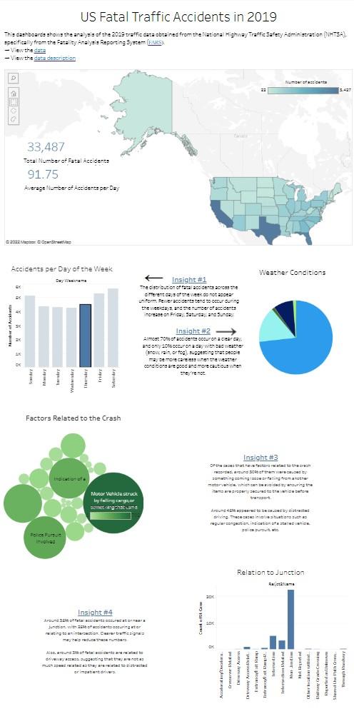

# US-traffic-fatalities
This project analyzes the US fatal traffic accident data obtained from the National Highway Traffic Safety Administration (NHTSA), specifically from the Fatality Analysis Reporting System ([FARS](https://www.nhtsa.gov/file-downloads?p=nhtsa/downloads/FARS/))

Check out the data element descriptions [here](https://github.com/jessicasyau/US-traffic-fatalities/blob/db57961853729978feb385b5c7aed729ac4afa44/description_fields/0.%20Data_descriptions.md)

## Exploratory Analysis of a Specific Year's Data
[Here](https://public.tableau.com/views/USFatalTrafficAccidents/Dashboard1?:language=en-US&:display_count=n&:origin=viz_share_link) is a data visualization of the 2019 fatal traffic data with a few quick insights.

## Analysis of Fatal Traffic Accident Data From 2000 to 2020
The code for this analysis is documented in this [Jupyter notebook](https://github.com/jessicasyau/US-traffic-fatalities/blob/9dcc3e60dd595c1cdaf236ecdb74c9696da9f0f9/us-fatal-traffic-accidents.ipynb).

We started by exploring if the following factors correlated with the number of fatal traffic accidents.

**Day of the Week**

**Lighting Condition**

**Weather**

**Time - Weekdays**

**Time - Weekends**

**School Bus**

**State**

**First Harmful Event**

- which states have more accidents per capita?
- what's the relationship between drinking and traffic accidents? which states have the most drunk-driver-caused accidents as a percent of all accidents?
- what's the relationship between weather condition and accidents?
- what's the relationship between road type and accidents?
- what's the break-down of accident types?
- predict accident (binary) based on certain features
- what's the relationship between time and accidents?

create visualizations for the summaries [here](https://www-fars.nhtsa.dot.gov/Main/index.aspx)
