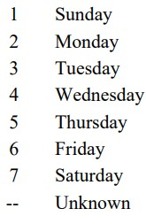

This file documents the data element definitions and codes seen as the column headers in the FARS_accident_2019 csv. To view the original full document click [here](https://crashstats.nhtsa.dot.gov/Api/Public/ViewPublication/813254).

### STATE
- Identifies the State in which the crash occurred.
- 

### STATENAME
- Identifies the name of the state in which the crash occurred.
- String

### ST_CASE	
- The unique case number assigned to each crash.
- [x]xxxxx - [one]/two characters for state code followed by four characters for case number

### VE_TOTAL
- The number of contact motor vehicles that the officer reported on the police crash report as a unit involved in the crash. This includes vehicles in transport and vehicles not in transport (i.e. parked vehicles)
- 1-999

### VE_FORMS
- Number of Vehicle Forms Submitted- ALL 
- Number of Motor Vehicles in Transport (MVIT) 
- A count of the number of motor vehicles in transport involved in the crash. Legally parked vehicles are not included.
- 1-999

### PVH_INVL
- Number of Parked/Working Vehicles
- A count of the number of parked and working vehicles involved in the crash.
- 0-999

### PEDS
- Number of Forms Submitted for Persons Not in Motor Vehicles
- The number of Person Forms (Not a Motor Vehicle Occupant) that are applicable to this case (i.e., non-occupants).
- 0-99

### PERSONS
- Number of Forms Submitted for Persons in Motor Vehicles 
- A count of the number of Person Level (Motor Vehicle Occupant) Forms that are applicable to this case (i.e., occupants).
- 0-999

### PERMVIT
- Number of Persons in Motor Vehicles in Transport (MVIT) 
- A count of the number of motorists in the crash. A motorist is a driver, passenger or unknown occupant type of a motor vehicle in transport.
- 0-999

### PERNOTMVIT
- Number of Persons Not in Motor Vehicles in Transport (MVIT) 
- A count of the number of non-motorists in the crash. A non-motorist is defined as a pedestrian, a cyclist, an occupant of a motor vehicle not in transport, a person riding a horse, an occupant of an animal drawn conveyance, person associated with non-motorist conveyance (e.g., baby carriage, skate board, wheelchair), or an other non-motorist (e.g., person outside a trafficway, person in a house). 
- 0-98

### COUNTY
- The location of the unstabilized event with regard to the County. The codes are from the General Services Administration’s (GSA) publication of worldwide Geographic Location Codes (GLC).
- 

### COUNTYNAME
- xxx(xx) - The name of the county (code from the COUNTY field)

### CITY
- The location of the unstabilized event with regard to the City. The codes are from the General Services Administration’s (GSA) publication of worldwide Geographic Location Codes (GLC). 
- 

### CITYNAME
- Name of the city

### DAY
- The day in which the crash occurred.
- 

### DAYNAME
- The converted value from the DAY field.

### MONTH
- The month in which the crash occurred.
- 

### MONTHNAME
- The name of the month in which the crash occurred.

### YEAR
- xxxx - The year of the crash.

### DAY_WEEK
- The day of the week in which the crash occurred.
- 

### DAY_WEEKNAME
- The name of the day of the week in which the crash occurred.

### HOUR
- The hour in which the crash occurred.
- 

### HOURNAME
- The hour in which the crash occurred, converted to the 12 hour (am/pm) system.

### MINUTE
- The minute in which the crash occurred.
- 

### MINUTENAME
- The converted value from the MINUTE field.

### NHS
- National Highway System 
- Identifies whether this crash occurred on a trafficway that is part of the National Highway System. 
- 

### NHSNAME
- The converted value from the NHS field.

### ROUTE
- Route Signing
- identifies the route signing of the trafficway on which the crash occurred. 
- 

### ROUTENAME
- The converted value from the ROUTE field.

### TWAY_ID & TWAY_ID2
- Trafficway Identifier
- Records the trafficway on which the crash occurred. Beginning in 2004 a second trafficway identifier TWAY_ID2 was added to accommodate intersection and intersection-related crashes where the officer provides the identifier for the second trafficway.
- 

### RUR_URB
- Land Use
- identifies the classification of the segment of the trafficway on which the crash occurred based on FHWA-approved adjusted Census boundaries of small urban and urbanized areas
- 

### RUR_URBNAME
- The value converted from the RUB_URB field

### FUNC_SYS
- Functional System
- identifies the functional classification of the segment of the trafficway on which the crash occurred. 
- 

### FUNC_SYSNAME
- The value converted from the FUNC_SYS field

### RD_OWNER
- Ownership
- identifies the entity that has legal ownership of the segment of the trafficway on which the crash occurred. 
- 

### RD_OWNERNAME
- The value converted from the RD_OWNER field

### MILEPT
- Milepoint
- The milepoint nearest to the location where the crash
- 

### MILEPTNAME
- The value converted from the MILEPT field

### LATITUDE
- identifies the location of the crash using Global Position coordinates. This is the position of latitude. 
- 

### LATITUDENAME
- The value converted from the LATITUDE field

### LONGITUD
- identifies the location of the crash using Global Position coordinates. This is the position of longitude.
- 

### LONGITUDNAME
- The value converted from the LONGITUD field

### SP_JUR
- Special Jurisdiction 
- identifies if the location on the trafficway where the crash occurred qualifies as a Special Jurisdiction even though it may be patrolled by State, county or local police (e.g., all State highways running through Indian Reservations are under the jurisdiction of the Indian Reservation). 
- 

### SP_JURNAME
- The value converted from the SP_JUR field

### HARM_EV
- First Harmful Event 
- describes the first injury or damage producing event of the crash.
- 

### HARM_EVNAME
- The value converted from the HARM_EV field

### MAN_COLL
- Manner of Collision of the First Harmful Event 
- describes the orientation of two motor vehicles in transport when they are involved in the “First Harmful Event” of a collision crash. If the “First Harmful Event” is not a collision between two motor vehicles in transport, it is classified as such. 
- 

### MAN_COLLNAME
- The value converted from the MAN_COLL field

### RELJCT1
- Relation to Junction
-  identifies the crash’s location with respect to presence in an interchange area. The coding of this data element is based on the location of the “First Harmful Event” of the crash.
- 

### RELJCT1NAME
- The value converted from the RELJCT1 field

### RELJCT2
- Relation to Junction- Specific Location
- identifies the crash’s location with respect to presence in or proximity to components typically in junction or interchange areas. The coding of this data element is based on the location of the “First Harmful Event” of the crash. 
- 

### RELJCT2NAME
- The value converted from the RELJCT2 field

### TYP_INT
- Type of Intersection
- identifies and allows separation of various intersection types.
- 

### TYP_INTNAME
- The value converted from the TYP_INT field

### WRK_ZONE
- Work Zone 
- identifies a motor vehicle traffic crash in which the first harmful event occurs within the boundaries of a work zone or on an approach to or exit from a work zone, resulting from an activity, behavior, or control related to the movement of the traffic units through the work zone. 
- 

### WRK_ZONENAME
- The value converted from the WRK_ZONE field

### REL_ROAD
- Relation to Trafficway 
- identifies the location of the crash as it relates to its position within or outside the trafficway based on the “First Harmful Event.”
- 

### REL_ROADNAME
- The value converted from the REL_ROAD field

### LGT_COND
- Light Condition 
- records the type/level of light that existed at the time of the crash as indicated in the case material. 
- 

### LGT_CONDNAME
- The value converted from the LGT_COND field

### WEATHER
- Atmospheric Conditions
- records the prevailing atmospheric conditions that existed at the time of the crash as indicated in the case material.
- Prior to 2007 one value was coded for atmospheric condition. From 2007-2019 this data element was derived from up to two conditions that could be selected, WEATHER1 and WEATHER2, based on a hierarchy. The two coded data elements were discontinued after 2019 and moved to th
-  

### WEATHERNAME
- The value converted from the WEATHER field

### SCH_BUS
- School Bus Related 
- identifies if a school bus, or motor vehicle functioning as a school bus, is related to the crash. 
-  

### SCH_BUSNAME
- The value converted from the SCH_BUS field

### RAIL
- Rail Grade Crossing Identifier
- identifies if the crash occurred in or near a rail grade crossing
-  

### RAILNAME
- The value converted from the RAIL field

### NOT_HOUR
- Hour of Notification
- records the hour that emergency medical service was notified. All time is 24-hour military time
-  

### NOT_HOURNAME
- The value converted from the NOT_HOUR field

### NOT_MIN
- Minute of Notification
- records the minutes after the hour that emergency medical service was notified
-  

### NOT_MINNAME
- The value converted from the NOT_MIN field

### ARR_HOUR
- Hour of Arrival at Scene
- records the hour that emergency medical service arrived on the crash scene. All time is 24-hour military time
-  

### ARR_HOURNAME
- The value converted from the  field

### ARR_MIN
- Minute of Arrival at Scene
- records the minutes after the hour that emergency medical service arrived on the crash scene. 
-  

### ARR_MINNAME
- The value converted from the ARR_MIN field

### HOSP_HR
- Hour of EMS Arrival at Hospital
- records the hour that emergency medical service arrived at the treatment facility to which it was transporting victims of the crash. All time is 24-hour military time
-  

### HOSP_HRNAME
- The value converted from the HOSP_HR field

### HOSP_MN
- Minute of EMS Arrival at Hospital 
- records the minutes after the hour that emergency medical service arrived at the treatment facility to which it was transporting victims of the crash.
-  

### HOSP_MNNAME
- The value converted from the HOSP_MN field

### CF1, CF2, and CF3
- records factors related to the crash expressed in the case material. 
-  

### CF1NAME, CF2NAME, and CF3NAME
- The value converted from the CF1, CF2, and CF3 fields

### FATALS
- the number of fatally injured people in the crash.
- 1-99

### DRUNK_DR
- the number of drinking drivers involved in the crash
- 0-99
